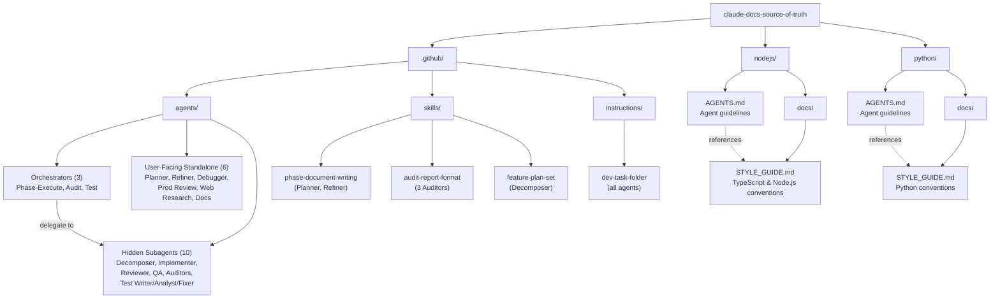
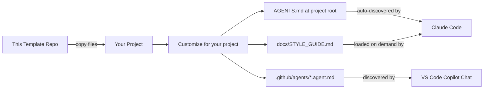
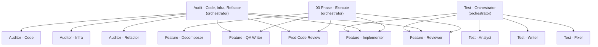

# Architecture

## Overview

This is a static template repository — it contains no runnable code. It provides two things:

1. **AGENTS.md and style guide templates** that configure Claude Code's behavior when copied into a target project
2. **VS Code Copilot agent definitions** (`.github/agents/`) that provide specialized development workflow agents

## Template Structure

%% Shows how template files and agent definitions are organized

## How the Files Work Together

Each language folder contains a two-file system:

### AGENTS.md (Primary)

The main instruction file that Claude Code discovers and reads automatically. It defines:

- **Workflow rules** — TDD process, commit standards, when to stop and reassess
- **Quality gates** — What must be true before every commit
- **Agent behavior** — Context clearing thresholds, subagent patterns, self-review
- **Language tooling** — Package management and dependency rules specific to the ecosystem
- **Extension pointer** — Directs the agent to load `docs/STYLE_GUIDE.md` when writing new code

### docs/STYLE_GUIDE.md (Extended)

A deeper reference that AGENTS.md points to. Loaded on demand when the agent is writing new modules or is unfamiliar with conventions. Covers:

- Naming, imports, and file organization
- Logging, configuration, and error handling patterns
- Type annotation and documentation requirements
- Language-specific idioms (async patterns, OOP vs functional style)

## Consumption Flow

%% Shows how a developer uses these templates in their own project

## Agent Architecture

The `.github/agents/` directory contains 19 agent definitions organized in an **orchestrator + subagent** pattern:

%% Shows the orchestrator delegation model

Three orchestrators share **Feature - Implementer** and **Feature - Reviewer** as common subagents for driving automated remediation. Each orchestrator follows the same pattern: analyze/audit first, then optionally run fixes through the implementation pipeline.

## Shared vs Language-Specific Content

Both AGENTS.md variants share identical sections for:

- Core principles (incremental progress, clear intent, single responsibility)
- TDD implementation flow
- Quality standards and commit checklist
- Agent operations (context clearing, subagents, self-review)
- Communication rules

They diverge on:

| Concern | Node.js variant | Python variant |
|---|---|---|
| Dependency management | npm, package-lock.json | uv, pyproject.toml |
| Property-based testing | fast-check | Hypothesis |
| Data modeling | TypeScript interfaces, strict mode | Pydantic v2 with frozen config |
| Style section in AGENTS.md | TypeScript naming, imports, types | Not duplicated (defers to style guide) |

## Design Decisions

- **Two files per language instead of one**: Keeps AGENTS.md focused on workflow/behavior while STYLE_GUIDE.md handles verbose coding conventions. Agents load the style guide only when needed, saving context window space.
- **Separate language folders**: Allows copying exactly one language's files without filtering. No conditional sections or language switches within a file.
- **No shared/base file**: Despite significant overlap, each AGENTS.md is self-contained. This avoids inheritance complexity and makes each file independently usable after copying.
- **Orchestrator + subagent pattern for agents**: Complex workflows are decomposed into focused subagents (marked `user-invocable: false`) coordinated by orchestrators. This keeps each agent's instructions small and prevents unintended user interaction with intermediate pipeline steps.
- **Shared subagents across orchestrators**: Feature - Implementer and Feature - Reviewer are reused by Phase - Execute, the Audit orchestrator, and the Test orchestrator — avoiding duplication of the implementation/review workflow.
- **Skills for shared templates**: When multiple agents use identical templates or report formats, those are extracted into `.github/skills/` as single-source-of-truth references. Agents load the skill at runtime instead of containing inline copies. This trades self-containment for DRY — a deliberate shift from the "fully self-contained" philosophy used for AGENTS.md templates, which are designed to be copied into other repos. Agent skills stay in this repo and are never copied, so the DRY benefit outweighs the cost.
- **Instructions for cross-cutting conventions**: `.github/instructions/` files with `applyTo` glob patterns inject shared conventions (like the `dev/[task-name]/` folder naming scheme) into all matching agents automatically, removing the need to duplicate the instruction in each agent file.

## Skills

Skills (`.github/skills/<name>/SKILL.md`) extract shared templates and formats that would otherwise be duplicated across multiple agent files. Agents reference skills by name; the skill is loaded on demand when the agent needs it.

| Skill | Used By | What It Contains |
|-------|---------|-----------------|
| `phase-document-writing` | 01 Project - Planner, 02 Phase - Refiner | Phase Document Template, Phases Overview Template, quality checklist |
| `audit-report-format` | Auditor - Code, Auditor - Infra, Auditor - Refactor | Report structure, findings table format, severity levels, priority tiers |
| `feature-plan-set` | Feature - Decomposer | Three-file plan convention, plan sections A–F, stage format, decomposition rules |

## Instructions

Instructions (`.github/instructions/*.instructions.md`) inject conventions into agents via `applyTo` glob matching. Unlike skills (which agents load explicitly), instructions are loaded automatically when the agent's file path matches the `applyTo` pattern.

| Instruction | Applies To | What It Does |
|-------------|-----------|--------------|
| `dev-task-folder` | `.github/agents/**` | Standardizes `dev/[task-name]/` naming and file suffix conventions |
