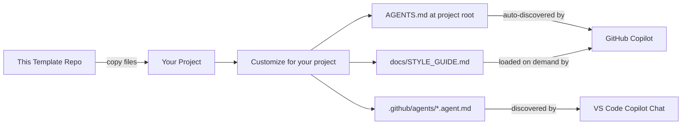

# Architecture

## Overview

This is a static template repository — it contains no runnable code. It provides two things:

1. **AGENTS.md and style guide templates** that configure GitHub Copilot's behavior when copied into a target project
2. **VS Code Copilot agent definitions** (`.github/agents/`) that provide specialized development workflow agents

## Template Structure

%% Shows how template files and agent definitions are organized

```mermaid
flowchart TD
    Root[github-agents-source-of-truth]
    Root --> GH[.github/]
    Root --> NodeDir[nodejs/]
    Root --> PyDir[python/]

    GH --> Agents[agents/]
    GH --> Skills[skills/]
    GH --> Instructions[instructions/]

    Agents --> Orchestrators["Orchestrators (3)\nPhase-Execute, Audit,\nTest"]
    Agents --> UserAgents["User-Facing Standalone (11)\nPlanner, Refiner, Decomposer,\nSingle Feature, Eval Grader,\nEvangelize, Debugger, Prod Review,\nWeb Research, Docs, Unity Reviewer"]
    Agents --> Subagents["Hidden Subagents (10)\nPlan Expander, Implementer,\nReviewer, QA, Auditors,\nTest Writer/Analyst/Fixer"]
    Orchestrators -->|delegate to| Subagents

    Skills --> S1["phase-document-writing\n(Planner, Refiner)"]
    Skills --> S2["auditor-conventions\n(3 Auditors)"]
    Skills --> S3["feature-plan-set\n(Decomposer, Plan Expander)"]
    Skills --> S4["implementation-pipeline-loop\n(Orchestrators)"]
    Skills --> S5["implementation-record\n(Feature - Implementer)"]
    Skills --> S6["unity-development\n(Implementer, Reviewer\nUnity projects)"]
    Skills --> S7["unity-review-knowledge\n(Unity Reviewer)"]
    Skills --> S8["context7-mcp\n(Context7 doc lookup)"]
    Skills --> S9["debug-issue\n(Debugger)"]
    Skills --> S10["explore-codebase\n(Explore)"]
    Skills --> S11["refactor-safely\n(Refactor)"]
    Skills --> S12["review-changes\n(Reviewer)"]
    Skills --> S13["eval-score-table-output\n(Eval Grader)"]

    Instructions --> I1["codebase-context-bootstrap\n(all agents)"]
    Instructions --> I2["dev-task-folder\n(all agents)"]
    Instructions --> I3["documentation-freshness-check\n(planner, refiner)"]
    Instructions --> I4["challenge-assumptions\n(planner, refiner)"]
    Instructions --> I5["graph-rebuild-hook\n(3 orchestrators)"]
    Instructions --> I6["orchestrator-conventions\n(3 orchestrators)"]
    Instructions --> I7["proactive-research\n(planner, refiner, debugger)"]
    Instructions --> I8["read-only-agent\n(9 read-only agents)"]
    Instructions --> I9["learnings-bootstrap\n(implementer, reviewer,\ndecomposer, debugger)"]
    Instructions --> I10["tech-stack-detection\n(implementer, reviewer)"]
    Instructions --> I11["subagent-autonomy\n(implementer, reviewer,\nplan-expander, git-commit)"]
    Instructions --> I12["output-verbosity-policy\n(all agents)"]
    Instructions --> I13["csharp-style\n(unity-reviewer, auditor-code,\nimplementer, reviewer)"]

    NodeDir --> NodeAgents[AGENTS.md<br/>Agent guidelines]
    NodeDir --> NodeDocs[docs/]
    NodeDocs --> NodeStyle[STYLE_GUIDE.md<br/>TypeScript & Node.js conventions]

    PyDir --> PyAgents[AGENTS.md<br/>Agent guidelines]
    PyDir --> PyDocs[docs/]
    PyDocs --> PyStyle[STYLE_GUIDE.md<br/>Python conventions]

    NodeAgents -. "references" .-> NodeStyle
    PyAgents -. "references" .-> PyStyle
```

## How the Files Work Together

Each language folder contains a two-file system:

### AGENTS.md (Primary)

The main instruction file that GitHub Copilot discovers and reads automatically. It defines:

- **Workflow rules** — TDD process, commit standards, when to stop and reassess
- **Quality gates** — What must be true before every commit
- **Agent behavior** — Context clearing thresholds, subagent patterns, self-review
- **Language tooling** — Package management and dependency rules specific to the ecosystem
- **Extension pointer** — Directs the agent to load `docs/STYLE_GUIDE.md` when writing new code

### docs/STYLE_GUIDE.md (Extended)

A deeper reference that AGENTS.md points to. Loaded on demand when the agent is writing new modules or is unfamiliar with conventions. Covers:

- Naming, imports, and file organization
- Logging, configuration, and error handling patterns
- Type annotation and documentation requirements
- Language-specific idioms (async patterns, OOP vs functional style)

## Consumption Flow

%% Shows how a developer uses these templates in their own project

## Agent Architecture

The `.github/agents/` directory contains 24 agent definitions organized in an **orchestrator + subagent** pattern:

%% Shows the orchestrator delegation model

```mermaid
flowchart TD
    PE["04 Phase - Execute\n(orchestrator)"]
    AO["Audit - Code, Infra, Refactor\n(orchestrator)"]
    TO["Test - Orchestrator\n(orchestrator)"]

    DW[Docs Writer]

    PE --> FD[Feature - Decomposer]
    PE --> FPE[Feature - Plan Expander]
    PE --> FI[Feature - Implementer]
    PE --> FR[Feature - Reviewer]
    PE --> FQ[Feature - QA Writer]
    PE --> PR[Prod Code Review]
    PE --> DW

    AO --> AC[Auditor - Code]
    AO --> AI[Auditor - Infra]
    AO --> AR[Auditor - Refactor]
    AO --> FI
    AO --> FR
    AO --> FQ
    AO --> PR
    AO --> DW

    TO --> TA[Test - Analyst]
    TO --> TW[Test - Writer]
    TO --> TF[Test - Fixer]
    TO --> FI
    TO --> FR
    TO --> DW
```

Three orchestrators share **Feature - Implementer** and **Feature - Reviewer** as common subagents for driving automated remediation. Each orchestrator follows the same pattern: analyze/audit first, then optionally run fixes through the implementation pipeline.

Standalone user-facing agents sit beside that orchestration graph: **01 Project - Planner**, **02 Phase - Refiner**, **03 Feature - Decomposer**, **Single Feature - Agent**, **05 Eval - Grader**, **Evangelize**, **Debugger**, **Docs Writer**, **Prod Code Review**, **Unity Reviewer**, and **Web Researcher**.

## Shared vs Language-Specific Content

Both AGENTS.md variants share identical sections for:

- Core principles (incremental progress, clear intent, single responsibility)
- TDD implementation flow
- Quality standards and commit checklist
- Agent operations (context clearing, subagents, self-review)
- Communication rules

They diverge on:

| Concern | Node.js variant | Python variant |
|---|---|---|
| Dependency management | npm, package-lock.json | uv, pyproject.toml |
| Property-based testing | fast-check | Hypothesis |
| Data modeling | TypeScript interfaces, strict mode | Pydantic v2 with frozen config |
| Style section in AGENTS.md | TypeScript naming, imports, types | Not duplicated (defers to style guide) |

## Design Decisions

- **Two files per language instead of one**: Keeps AGENTS.md focused on workflow/behavior while STYLE_GUIDE.md handles verbose coding conventions. Agents load the style guide only when needed, saving context window space.
- **Separate language folders**: Allows copying exactly one language's files without filtering. No conditional sections or language switches within a file.
- **No shared/base file**: Despite significant overlap, each AGENTS.md is self-contained. This avoids inheritance complexity and makes each file independently usable after copying.
- **Orchestrator + subagent pattern for agents**: Complex workflows are decomposed into focused subagents (marked `user-invocable: false`) coordinated by orchestrators. This keeps each agent's instructions small and prevents unintended user interaction with intermediate pipeline steps.
- **Shared subagents across orchestrators**: Feature - Implementer and Feature - Reviewer are reused by Phase - Execute, the Audit orchestrator, and the Test orchestrator — avoiding duplication of the implementation/review workflow.
- **Skills for shared templates**: When multiple agents use identical templates or report formats, those are extracted into `.github/skills/` as single-source-of-truth references. Agents load the skill at runtime instead of containing inline copies. This trades self-containment for DRY — a deliberate shift from the "fully self-contained" philosophy used for AGENTS.md templates, which are designed to be copied into other repos. Agent skills stay in this repo and are never copied, so the DRY benefit outweighs the cost.
- **Instructions for cross-cutting conventions**: `.github/instructions/` files with `applyTo` glob patterns inject shared conventions (like the `dev/feature/[0N-task-name]/` folder naming scheme) into all matching agents automatically, removing the need to duplicate the instruction in each agent file.

## Skills

Skills (`.github/skills/<name>/SKILL.md`) extract shared templates and formats that would otherwise be duplicated across multiple agent files. Agents reference skills by name; the skill is loaded on demand when the agent needs it.

| Skill | Used By | What It Contains |
|-------|---------|-----------------|
| `phase-document-writing` | 01 Project - Planner, 02 Phase - Refiner | Phase Document Template, Phases Overview Template, quality checklist |
| `auditor-conventions` | Auditor - Code, Auditor - Infra, Auditor - Refactor | Standard constraints, deliverables, file-type taxonomy, report format, severity levels |
| `feature-plan-set` | Feature - Decomposer, Feature - Plan Expander | Three-file plan convention, plan sections A–F, stage format, `0N-` directory numbering |
| `implementation-pipeline-loop` | Orchestrators (reference) | Standard Implement → Review → Commit → Mark Complete cycle, prompt templates, error handling |
| `implementation-record` | Feature - Implementer | Template for the implementation record artifact (`[0N-task-name]-implementation.md`) produced by the Feature - Implementer |
| `unity-development` | Feature - Implementer, Feature - Reviewer (Unity projects) | Implementation and review rules for Unity C# projects: MonoBehaviour lifecycle, UI Toolkit pitfalls, test authenticity, bootstrap verification, batch compilation gates |
| `unity-review-knowledge` | Unity Reviewer | Unity best practices distilled from 11 official Unity ebooks (Unity 6 edition): C# style, performance/profiling, architecture/design patterns, DOTS/ECS, 2D art/rendering |
| `context7-mcp` | Any agent handling library/framework/API questions | Context7 workflow for current documentation lookup (`resolve-library-id` -> `query-docs`) |
| `debug-issue` | Debugger | Graph-powered debug workflow: semantic search, call-chain tracing, change detection, impact analysis |
| `explore-codebase` | Explore agent, general exploration | Graph-powered navigation: architecture overview, community detection, relationship tracing, execution flow |
| `refactor-safely` | Refactor pipelines | Graph-powered refactoring: dead-code detection, rename preview, impact radius, safety checks |
| `review-changes` | Reviewer agents | Graph-powered structured review: change detection, risk scoring, test coverage lookup, blast radius analysis |
| `eval-score-table-output` | Eval - Grader | Additive markdown table format for persistent score history with normalized `1-10` comparison axes |

## Instructions

Instructions (`.github/instructions/*.instructions.md`) inject conventions into agents via `applyTo` glob matching. Unlike skills (which agents load explicitly), instructions are loaded automatically when the agent's file path matches the `applyTo` pattern.

| Instruction | Applies To | What It Does |
|-------------|-----------|--------------|
| `codebase-context-bootstrap` | `.github/agents/**` | Reads `docs/CODEBASE_CONTEXT.md` before discovery to reduce redundant codebase scanning |
| `dev-task-folder` | `.github/agents/**` | Standardizes `dev/feature/[0N-task-name]/` naming, file suffixes, and per-feature QA output paths |
| `documentation-freshness-check` | 01-project-planner, 02-phase-refiner | Checks for `README.md` and `docs/CODEBASE_CONTEXT.md`, recommends `@Docs Writer` if missing |
| `orchestrator-conventions` | 3 orchestrator agents | Shared constraints: progress tracking, output verification, pipeline discipline, review reject loop |
| `graph-rebuild-hook` | 3 orchestrator agents | Triggers a deterministic code-review-graph build at the end of every orchestrator pipeline |
| `read-only-agent` | 9 read-only agents | No codebase modification + approval-before-writing constraints (with subagent exception) |
| `challenge-assumptions` | 01-project-planner, 02-phase-refiner | Push back on user requests that break patterns or add unnecessary complexity |
| `proactive-research` | 01-project-planner, 02-phase-refiner, debugger | Invoke `@Web Researcher` for unfamiliar technologies, errors, or APIs instead of asking the user |
| `learnings-bootstrap` | implementer, reviewer, decomposer, debugger | Read `.github/learnings/*.md` files before starting work |
| `tech-stack-detection` | implementer, reviewer | Detect specialized tech stacks and load matching skills before proceeding |
| `subagent-autonomy` | implementer, reviewer, plan-expander, git-commit | Operate autonomously — no questions, no confirmation, sensible defaults |
| `output-verbosity-policy` | `.github/agents/**` | Defines soft-target concision defaults, delta-first response shape, and quality-preserving exception triggers |
| `csharp-style` | unity-reviewer, auditor-code, implementer, reviewer | C# (Google) style rules for naming, organization, formatting, and idiomatic C# |

## Platform Variants

This repository tracks four platform surfaces. The `.github/` directory is the **master source of truth**. `opencode/` and `claude/` are derived checked-in copies, while `codex/` is the repository-owned authoring area for Codex documentation and future source artifacts.

### Source of Truth

- **`.github/agents/*.agent.md`** — Master agent definitions. All changes originate here.
- **`.github/instructions/*.instructions.md`** — Master instruction files. Loaded by `.github/` agents via `applyTo` YAML patterns.
- **`.github/skills/`** — Master skill definitions. Symlinked by both `opencode/` and `claude/`.
- **`codex/`** — Repository-owned Codex layout contract, documentation, and future source artifacts that will later map into Codex runtime locations. `codex/PILOT_SLICE_PLAN.md` defines the first validation trio (one instruction slice, one custom agent, one skill) and the exit criteria that gate any broader Codex conversion work.

When modifying shared agent behavior: edit the `.github/` master first, then apply equivalent changes to the checked-in `opencode/` and `claude/` copies. Codex work starts in `codex/` as repo-owned documentation or source material and maps later into runtime `.codex/`, `~/.codex/`, or `$HOME/.agents/skills/` locations.

### How Each Platform Loads Components

| Component | `.github/` (Copilot) | `opencode/` | `claude/` | `codex/` |
|-----------|---------------------|-------------|-----------|-----------|
| **Agent files** | `.github/agents/*.agent.md` (YAML frontmatter with `name:`, `description:`, `tools:`, and optional `agents:` / `user-invocable:`) | `opencode/agents/*.md` (YAML frontmatter with `permission:`, `mode:`, `hidden:`) | `claude/agents/*.md` (Markdown with `tools:` line, `z-` prefix for subagents) | Repository-owned docs today; future source artifacts may live under `codex/` and map to runtime TOML agents in `~/.codex/agents/` or `.codex/agents/` |
| **Instructions** | Loaded from `.github/instructions/` via `applyTo` glob patterns in YAML frontmatter | Loaded from `.github/instructions/` via glob in `~/.config/opencode/opencode.jsonc`: `"instructions": [".github/instructions/*.instructions.md"]` | **Inlined** in each agent under `## Auto-Loaded Instructions` — not loaded from instruction files | Repository-owned guidance belongs under `codex/`; runtime installation targets Codex AGENTS files such as `~/.codex/AGENTS.md`, not a checked-in `.github/instructions/` equivalent |
| **Skills** | Loaded from `.github/skills/` on demand | Symlinked to `.github/skills/` (set up via `SYMLINK_SETUP.md`) | Symlinked to `.github/skills/` (set up via `SYMLINK_SETUP.md`) | Future skill-copy source belongs under `codex/`; runtime Codex discovers installed skills from `$HOME/.agents/skills/` or repo-local `.agents/skills` |
| **Learnings** | `.github/learnings/` | N/A | Symlinked to `.github/learnings/` | No separate Codex learning surface is defined in this phase |

### Key Implication

**Codex is not a direct checked-in mirror of `.github/`.** Updating `.github/instructions/` automatically affects both `.github/` and `opencode/` agents because opencode loads the same instruction files, while Claude agents require separate inline updates to their `## Auto-Loaded Instructions` sections. Codex changes start as repository-owned material under `codex/` and are mapped later to runtime AGENTS, custom-agent, and skill locations.

### Agent File Format Differences

| Concern | `.github/` | `opencode/` | `claude/` |
|---------|-----------|-------------|-----------|
| File extension | `.agent.md` | `.md` | `.md` |
| Tools declaration | `tools: [read, search, edit, execute, agent]` | `permission: {read: allow, edit: allow, ...}` | `tools: Skill, Read, Grep, Glob, Edit, Write, Bash, Agent` |
| Model selection | Harness-selected at runtime; not pinned in `.github/agents/*.agent.md` frontmatter | `deepseek/deepseek-v4-pro` | N/A (model set in Claude config) |
| Subagent flag | `user-invocable: false` | `mode: subagent` + `hidden: true` | Filename prefixed with `z-` |
| Agent references | `agents: [Web Researcher]` | N/A | Referenced by filename in workflow text |
| Subagent naming | No prefix convention | No prefix convention | `z-` prefix (e.g., `z-feature-implementer.md`) |
