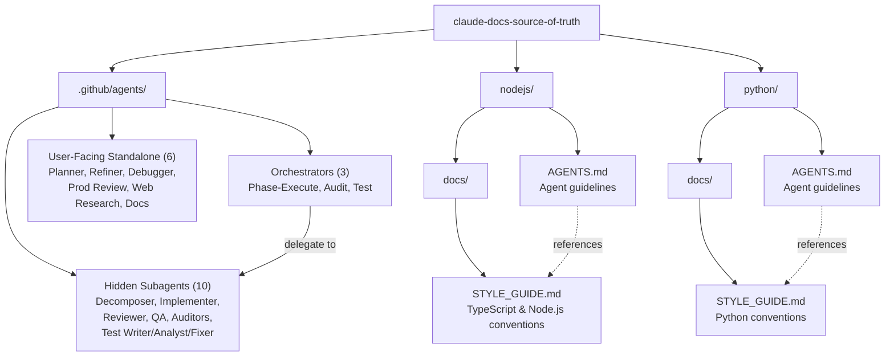
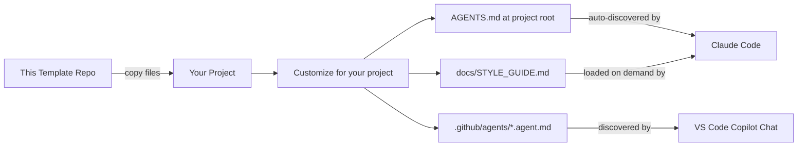
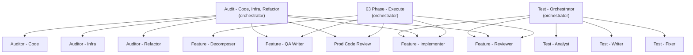

# Architecture

## Overview

This is a static template repository — it contains no runnable code. It provides two things:

1. **AGENTS.md and style guide templates** that configure Claude Code's behavior when copied into a target project
2. **VS Code Copilot agent definitions** (`.github/agents/`) that provide specialized development workflow agents

## Template Structure

%% Shows how template files and agent definitions are organized

## How the Files Work Together

Each language folder contains a two-file system:

### AGENTS.md (Primary)

The main instruction file that Claude Code discovers and reads automatically. It defines:

- **Workflow rules** — TDD process, commit standards, when to stop and reassess
- **Quality gates** — What must be true before every commit
- **Agent behavior** — Context clearing thresholds, subagent patterns, self-review
- **Language tooling** — Package management and dependency rules specific to the ecosystem
- **Extension pointer** — Directs the agent to load `docs/STYLE_GUIDE.md` when writing new code

### docs/STYLE_GUIDE.md (Extended)

A deeper reference that AGENTS.md points to. Loaded on demand when the agent is writing new modules or is unfamiliar with conventions. Covers:

- Naming, imports, and file organization
- Logging, configuration, and error handling patterns
- Type annotation and documentation requirements
- Language-specific idioms (async patterns, OOP vs functional style)

## Consumption Flow

%% Shows how a developer uses these templates in their own project

## Agent Architecture

The `.github/agents/` directory contains 19 agent definitions organized in an **orchestrator + subagent** pattern:

%% Shows the orchestrator delegation model

Three orchestrators share **Feature - Implementer** and **Feature - Reviewer** as common subagents for driving automated remediation. Each orchestrator follows the same pattern: analyze/audit first, then optionally run fixes through the implementation pipeline.

## Shared vs Language-Specific Content

Both AGENTS.md variants share identical sections for:

- Core principles (incremental progress, clear intent, single responsibility)
- TDD implementation flow
- Quality standards and commit checklist
- Agent operations (context clearing, subagents, self-review)
- Communication rules

They diverge on:

| Concern | Node.js variant | Python variant |
|---|---|---|
| Dependency management | npm, package-lock.json | uv, pyproject.toml |
| Property-based testing | fast-check | Hypothesis |
| Data modeling | TypeScript interfaces, strict mode | Pydantic v2 with frozen config |
| Style section in AGENTS.md | TypeScript naming, imports, types | Not duplicated (defers to style guide) |

## Design Decisions

- **Two files per language instead of one**: Keeps AGENTS.md focused on workflow/behavior while STYLE_GUIDE.md handles verbose coding conventions. Agents load the style guide only when needed, saving context window space.
- **Separate language folders**: Allows copying exactly one language's files without filtering. No conditional sections or language switches within a file.
- **No shared/base file**: Despite significant overlap, each AGENTS.md is self-contained. This avoids inheritance complexity and makes each file independently usable after copying.
- **Orchestrator + subagent pattern for agents**: Complex workflows are decomposed into focused subagents (marked `user-invocable: false`) coordinated by orchestrators. This keeps each agent's instructions small and prevents unintended user interaction with intermediate pipeline steps.
- **Shared subagents across orchestrators**: Feature - Implementer and Feature - Reviewer are reused by Phase - Execute, the Audit orchestrator, and the Test orchestrator — avoiding duplication of the implementation/review workflow.
