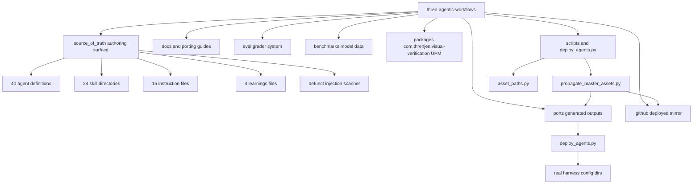
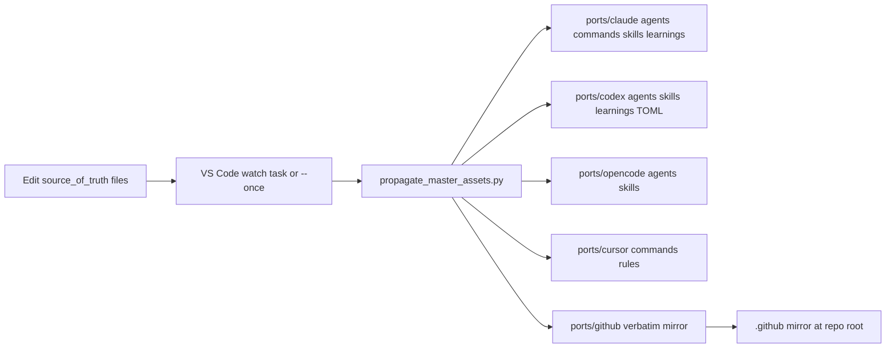
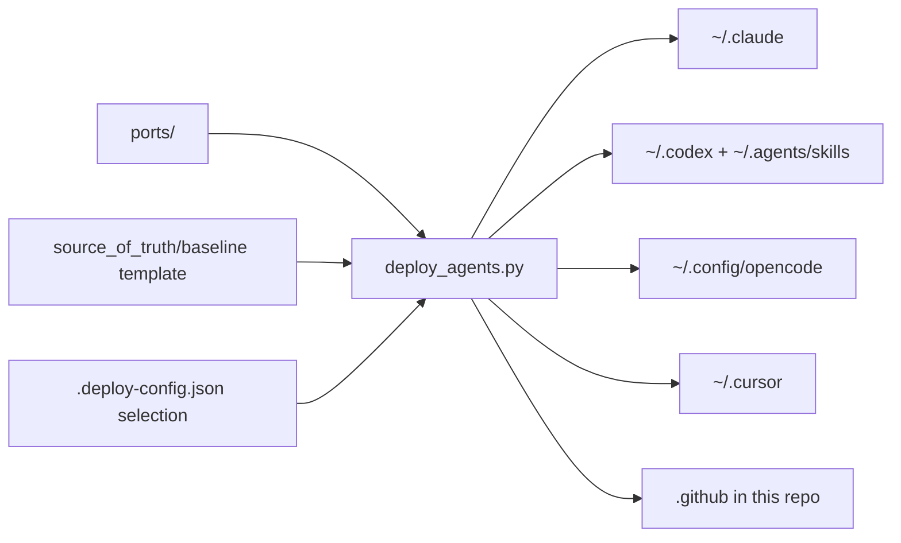
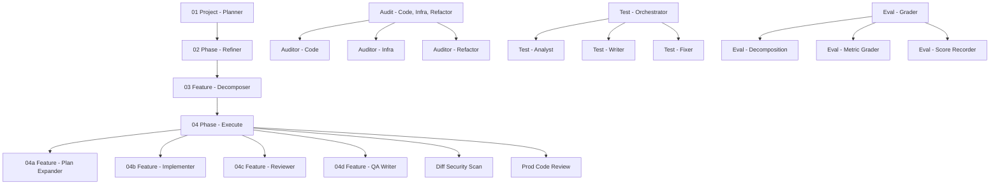

# Architecture

## Overview

This repository is organized around one authoring surface and a two-stage pipeline:

- `source_of_truth/` is the master source for agent definitions, skills, instructions,
  learnings, and hooks.
- `ports/{claude,codex,opencode,cursor,github}` are generated outputs.
- `.github/` at the repo root is a real, deployed mirror of `ports/github`.
- `docs/`, `eval/`, `benchmarks/`, and `packages/` are supporting material.

The repository code is transform-and-deploy tooling. `scripts/propagate_master_assets.py`
rewrites the generated `ports/` variants (and the `.github/` mirror) after changes in
`source_of_truth/`. `deploy_agents.py` copies the converged `ports/` outputs out to the
real user-level directories each harness reads. Both scripts share
`scripts/asset_paths.py`, which owns the generated-output markers, the marker-ownership
check, and the poll-based watch loop.

## Top-Level Component Map

%% Shows the authoring surface, the two-stage pipeline, generated outputs, and supporting material.

## The Two-Stage Pipeline

### Stage 1 — Transform (propagate_master_assets.py)

%% Shows how edits under source_of_truth are transformed into per-harness ports/ outputs and the .github mirror.

The transform runs to a fixed point: `propagate_until_converged` repeats a single pass
until a pass makes zero changes (max 25 passes). Each pass rewrites agents per platform,
regenerates skills and learnings, emits Cursor commands and rules, and mirrors the five
source subdirs to `ports/github` and `.github/`.

The watcher in `.vscode/tasks.json` starts on folder open and monitors the five source
directories (`agents`, `skills`, `instructions`, `learnings`, `hooks`). `--once` (the
default when no flag is passed) and `--watch` use the same transformation logic.

### Stage 2 — Deploy (deploy_agents.py)

%% Shows how converged ports/ outputs are deployed to real harness config directories.

Deploy is a simple direct copy with generated-marker ownership. A destination file is
copied only when its bytes differ, and overwritten or pruned only when it carries a
generated marker (or lives inside a marked skill directory). Files without a marker are
foreign and never touched — they are surfaced under `skipped_paths` in the run output so
a fail-closed skip is visible, not silent. The `github` harness is the one exception:
its mirrored tree is copied verbatim (no per-file marker), so it is treated as
unconditionally managed within the five mirrored subdirs.

After the asset copy, deploy renders a per-harness **baseline instructions file** from
`source_of_truth/baseline/baseline-instructions.md`. The template holds three sections
wrapped in HTML sentinel comments (`<!-- context7 -->`, `<!-- code-review-graph -->`,
`<!-- agent-discovery -->`); placeholders for harness name and agent/skill paths are
substituted at deploy time using the machine's real home directory, so no OS branching
is needed. Deploy splices each sentinel-delimited section into the destination —
replacing an existing block in place or appending a missing one — and never touches
content outside the sentinels, so a hand-maintained `CLAUDE.md`/`AGENTS.md` keeps its
own content. Destinations: `CLAUDE.md` under the Claude config dir, `AGENTS.md` under
the Codex and OpenCode config dirs, an `alwaysApply` rule at
`~/.cursor/rules/baseline-instructions.mdc` for Cursor (deliberately unmarked so the
rules prune pass treats it as foreign), and `.github/copilot-instructions.md` for the
github harness (a `.github/AGENTS.md` would only scope to files under `.github/`).

Before deploying assets (unless `--skip-tools` is passed), deploy bootstraps two
optional companion tools: code-review-graph (installed via `pip`/`pipx`, configured
with `code-review-graph install`) and the Context7 MCP server (configured via
`npx ctx7 setup`). Every outcome is reported; a failed bootstrap prints a warning
with the reason and never aborts asset deployment.

## Major Components

### `source_of_truth/`

The only authoring surface.

- `agents/` — 40 agent definitions. Most use the `.agent.md` suffix; `docs-writer.md`
  and `prod-code-review.md` are intentional plain-`.md` exceptions still loaded as
  agents because loading keys off `name`/`description` frontmatter, not the suffix.
- `skills/` — 24 directory-based skills, each rooted at `SKILL.md`.
- `instructions/` — 15 instruction files matched by `applyTo` globs.
- `learnings/` — 4 cross-cutting learnings files.
- `hooks/` — a defunct prompt-injection scanner, retained but wired nowhere. See
  `source_of_truth/hooks/DEFUNCT.md`.
- `baseline/` — `baseline-instructions.md`, the sentinel-sectioned baseline
  instructions template rendered per harness at deploy time (not propagated to
  `ports/`, since it needs the deployed machine's real paths).

### Generated outputs (`ports/`)

Not edited by hand in the normal workflow. Regenerated from `source_of_truth/` with
platform-specific transformations:

- tool declarations are remapped per platform
- agent references are rewritten to the correct generated identifiers
- hidden subagents gain `z-` naming for Claude and Codex outputs
- applicable instruction content is inlined when the destination platform does not
  support `instructions/` directly
- Cursor: user-invocable agents become `commands/*.md`; instructions and learnings
  become `rules/*.mdc` (agent-targeted instructions are excluded, since their content
  ships inside the rendered agents)

Known filename aliases preserved during propagation: `docs-writer` → `docs-writer`,
`web-research-specialist` → `web-researcher`, `audit-code-or-infra` →
`audit-code-infra-refactor`.

### The `.github/` mirror

`ports/github` is a verbatim copy of the five mirrored source subdirs, and `.github/`
at the repo root is a real deployed copy of it. Only the five mirrored subdirs
(`agents`, `hooks`, `instructions`, `learnings`, `skills`) are touched — anything else
in `.github/` (for example a future `workflows/`) is left alone.

### Shared module (`scripts/asset_paths.py`)

Owns the generated-marker constants (current `source_of_truth` markers plus legacy
`.github` markers that are still honored so the marker-text change did not orphan old
files), the positional marker-ownership check (`file_has_generated_marker` — a file
that merely quotes a marker in prose stays inert), and the debounced `poll_watch` loop
used by both scripts' watch modes.

### Supporting material

- `docs/` — architecture, setup, troubleshooting, porting guides, and inspiration write-ups.
- `eval/` — the agent evaluation grader system, rubrics, hook templates, and run artifacts.
- `benchmarks/` — model cost/performance benchmark data and charts.
- `packages/com.threnjen.visual-verification/` — a Unity UPM package for deterministic
  screenshot capture, paired with the Visual Verifier agent.

## Agent System Shape

The source agent system uses an orchestrator + subagent pattern with integrated
evaluation and QA stages.

%% Shows high-level source agent relationships: planning, execution, eval, and support.

## External Dependencies And Integrations

- Python standard library only for both scripts; no project package manifest is required.
- VS Code task integration via `.vscode/tasks.json` for propagate (once/watch) and deploy (watch).
- Code-review-graph MCP as a review/exploration aid (see `AGENTS.md`); auto-installed
  by the deploy script when absent.
- Context7 MCP for current library documentation; auto-configured by the deploy script
  (requires Node.js for `npx`).
- Claude Code, Codex, OpenCode, Cursor, and GitHub Copilot as the deployment targets.

## Design Decisions

- Keep `source_of_truth/` as the only authoritative source for shared agent behavior.
- Split the pipeline into a transform stage (safe to auto-run on save) and a deploy
  stage (explicit, selection-driven), so regeneration never mutates real config dirs.
- Deploy with generated-marker ownership: only ever overwrite/prune files this system
  wrote; surface fail-closed skips instead of guessing.
- Regenerate platform variants instead of hand-maintaining parallel agent files.
- Mirror the source verbatim to `ports/github` and `.github/` so Copilot reads the
  same content without transformation.
- Use directory-based skills and instruction files so shared guidance is reused, not
  duplicated across agent bodies.
