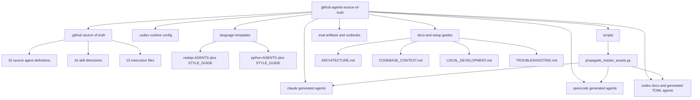
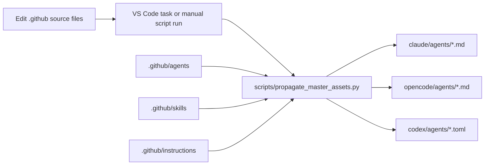

# Architecture

## Overview

This repository is organized around one authoring surface and several downstream consumers:

- `.github/` is the master source-of-truth for agent definitions, reusable skills, and shared instructions.
- `claude/`, `opencode/`, and `codex/agents/` are generated or derived outputs.
- `nodejs/` and `python/` provide copyable project templates.
- `docs/`, `eval/`, and harness setup references explain how to use and maintain the system.

The only code in the repo is maintenance tooling, primarily `scripts/propagate_master_assets.py`, which rewrites the generated platform variants after changes in `.github/`.

## Top-Level Component Map

%% Shows the repository's authoring surfaces, generated outputs, and supporting docs.

## Propagation Flow

%% Shows how edits in the master source are transformed into platform-specific outputs.

The watcher task in `.vscode/tasks.json` starts automatically on folder open and monitors `.github/agents/`, `.github/skills/`, and `.github/instructions/`. The one-shot task and `--once` CLI path use the same transformation logic.

## Major Components

### `.github/`

This is the primary authoring surface.

- `.github/agents/` contains 32 source agent definitions.
- Most source agents use the `.agent.md` suffix.
- `prod-code-review.md` is an intentional plain `.md` exception that is still loaded as an agent because the propagation script keys off frontmatter, not only filename suffixes.
- `.github/skills/` contains 16 directory-based skills, each rooted at `SKILL.md`.
- `.github/instructions/` contains 15 reusable instruction files matched by `applyTo` globs.

### Generated platform outputs

`claude/agents/`, `opencode/agents/`, and `codex/agents/` are not edited manually in the normal workflow. They are regenerated from `.github/` with platform-specific transformations:

- tool declarations are remapped per platform
- agent references are rewritten to the correct generated identifiers
- hidden subagents gain platform-specific naming or flags
- applicable instruction content is appended or inlined when the destination platform does not support `.github/instructions/` directly

For normal agent, instruction, and skill work in this repo, discovery and edits should stay inside `.github/`. The downstream platform directories are for generated output verification or intentional porting only.

The propagation script also preserves several filename aliases, including `documentation-architect` to `docs-writer` and `web-research-specialist` to `web-researcher`.

### `codex/` versus `.codex/`

These directories serve different purposes.

- `codex/` is repository-owned source material and generated TOML output for Codex work.
- `.codex/` is repo-scoped runtime configuration used by Codex itself.

The separation is deliberate so the repository can document Codex authoring without treating runtime configuration as source-of-truth content.

### Language template sets

`nodejs/` and `python/` are copyable starter packages for target repositories.

Each language folder contains:

- `AGENTS.md` for high-signal workflow and coding guidance
- `docs/STYLE_GUIDE.md` for detailed conventions loaded on demand

The two variants intentionally share structure while diverging on ecosystem-specific tooling and style expectations.

### Supporting docs and evaluation assets

- `docs/` holds contributor-facing architecture, setup, and troubleshooting material.
- `eval/` holds grader usage docs, example config, rubrics, hook templates, and historical score output.
- `HARNESS_SETUP.md` documents how to expose these agents and skills to different harnesses.

## Agent System Shape

The source agent system uses an orchestrator-plus-subagent pattern, with integrated evaluation and quality assurance stages.

%% Shows the high-level source agent relationships, including planning, execution, eval, and support agents.

```mermaid
flowchart TD
    Planner[01 Project - Planner]
    Refiner[02 Phase - Refiner]
    Decomposer[03 Feature - Decomposer]
    PhaseExecute[04 Phase - Execute]
    Audit[Audit - Code, Infra, Refactor]
    Test[Test - Orchestrator]
    ProdReview[Prod Code Review]
    EvalGrader[Eval - Grader]

    PlanExpander[04a Feature - Plan Expander]
    Implementer[04b Feature - Implementer]
    Reviewer[04c Feature - Reviewer]
    QA[04d Feature - QA Writer]
    Security[Security Scan]
    
    AuditorCode[Auditor - Code]
    AuditorInfra[Auditor - Infra]
    AuditorRefactor[Auditor - Refactor]
    
    TestAnalyst[Test - Analyst]
    TestWriter[Test - Writer]
    TestFixer[Test - Fixer]
    
    EvalDecomp[Eval - Feature Decomposition]
    EvalMetric[Eval - Metric Grader]
    EvalScore[Eval - Score Recorder]
    
    Support[Support Agents]
    DocsWriter[Documentation Architect]
    Debugger[Debugger]
    Evangelize[Evangelize]
    Single[Single Feature - Agent]
    Unity[Unity Reviewer]
    Web[Web Researcher]

    Planner --> Refiner
    Refiner --> Decomposer
    Decomposer --> PhaseExecute
    
    PhaseExecute --> PlanExpander
    PhaseExecute --> Implementer
    PhaseExecute --> Reviewer
    PhaseExecute --> QA
    PhaseExecute --> Security
    PhaseExecute --> DocsWriter
    
    Audit --> AuditorCode
    Audit --> AuditorInfra
    Audit --> AuditorRefactor
    
    Test --> TestAnalyst
    Test --> TestWriter
    Test --> TestFixer
    
    EvalGrader --> EvalDecomp
    EvalGrader --> EvalMetric
    EvalGrader --> EvalScore
    
    Support --> Unity
    Support --> Web
    Support --> Debugger
    Support --> Evangelize
    Support --> Single
    Support --> ProdReview
```

## External Dependencies And Integrations

- Python standard library only for `scripts/propagate_master_assets.py`; no project package manifest is required.
- VS Code task integration via `.vscode/tasks.json` for one-shot and watch propagation.
- Code-review-graph MCP registration via `.mcp.json` and `.codex/config.toml` using `uvx code-review-graph serve`.
- GitHub Copilot, Claude Code, OpenCode, and Codex as the target harnesses described by the repo.

## Design Decisions

- Keep `.github/` as the only authoritative source for shared agent behavior.
- Regenerate platform variants instead of hand-maintaining parallel agent files.
- Separate `codex/` authoring content from `.codex/` runtime configuration.
- Keep template language packs self-contained so users can copy one folder into another repo without inheritance machinery.
- Use directory-based skills and instruction files so shared guidance can be reused instead of duplicated across agent bodies.
