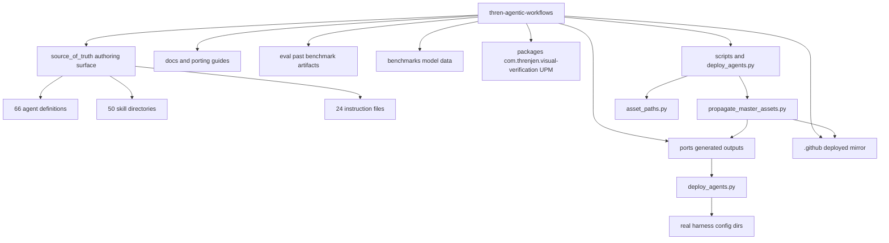
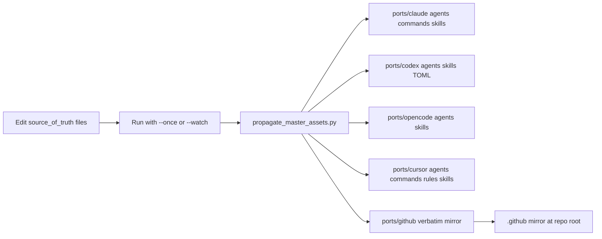
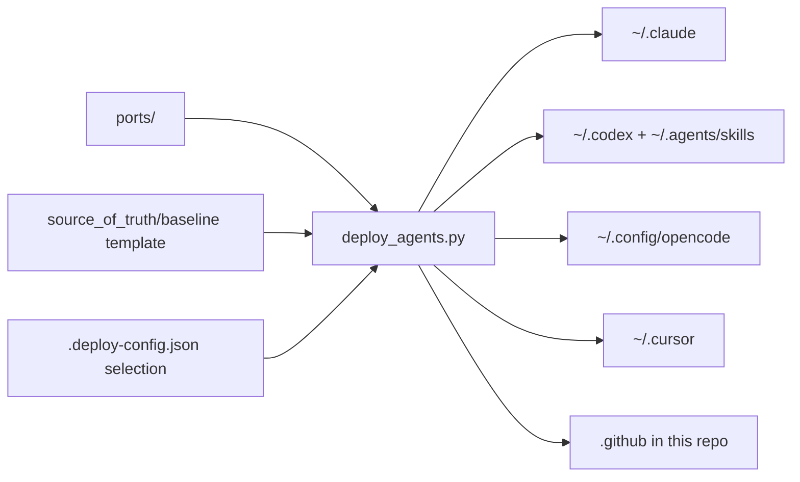
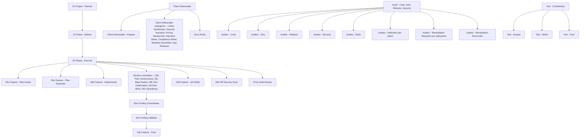

# Architecture

## Overview

This repository is organized around one authoring surface and a two-stage pipeline:

- `source_of_truth/` is the master source for agent definitions, skills, and instructions.
- `ports/{claude,codex,opencode,cursor,github}` are generated outputs.
- `.github/` at the repo root is a real, deployed mirror of `ports/github`.
- `docs/`, `eval/`, `benchmarks/`, and `packages/` are supporting material.

The repository code is transform-and-deploy tooling. `scripts/propagate_master_assets.py`
rewrites the generated `ports/` variants (and the `.github/` mirror) after changes in
`source_of_truth/`. `deploy_agents.py` copies the converged `ports/` outputs out to the
real user-level directories each harness reads. Both scripts share
`scripts/asset_paths.py`, which owns the generated-output markers, the marker-ownership
check, and the poll-based watch loop.

## Top-Level Component Map

%% Shows the authoring surface, the two-stage pipeline, generated outputs, and supporting material.

## The Two-Stage Pipeline

### Stage 1 — Transform (propagate_master_assets.py)

%% Shows how edits under source_of_truth are transformed into per-harness ports/ outputs and the .github mirror.

The transform runs to a fixed point: `propagate_until_converged` repeats a single pass
until a pass makes zero changes (max 25 passes). Each pass rewrites agents per platform,
regenerates skills, emits Cursor agents, commands, rules, and skills, and mirrors the source subdirs
(`agents`, `hooks`, `instructions`, `skills`) to `ports/github` and `.github/`. Only
`agents`, `instructions`, and `skills` exist under `source_of_truth/`; a mirrored subdir
that is absent is simply skipped.

`--watch` monitors those same source directories. `--once` (the default when no flag is
passed) and `--watch` use the same transformation logic.

Propagation is a maintainer step run by hand. A `PreToolUse` hook
(`.claude/hooks/block-propagation.py`, wired in `.claude/settings.json`) blocks any agent
attempt to execute the script, because a regeneration sweep buries the authored source
diff. Reading or grepping the script stays allowed; only execution is blocked.

### Stage 2 — Deploy (deploy_agents.py)

%% Shows how converged ports/ outputs are deployed to real harness config directories.

Deploy is a simple direct copy with generated-marker ownership. A destination file is
copied only when its bytes differ, and overwritten or pruned only when it carries a
generated marker (or lives inside a marked skill directory). Files without a marker are
foreign and never touched — they are surfaced under `skipped_paths` in the run output so
a fail-closed skip is visible, not silent. The `github` harness is the one exception:
its mirrored tree is copied verbatim (no per-file marker), so it is treated as
unconditionally managed within the mirrored subdirs.

After the asset copy, deploy renders a per-harness **baseline instructions file** from
`source_of_truth/baseline/baseline-instructions.md`. That template is a manifest, not a
body: `baseline_section_names` reads its bullet list, and each bullet names an
instruction under `source_of_truth/instructions/` carrying `baseline: true`. Deploy loads
each named instruction, strips its frontmatter and its Load Canary section, demotes the
H1 to an H2, and splices the result under a `<!-- <name> -->` sentinel. It then splices
one aggregate `<!-- baseline-canary -->` section naming every section it wrote, because
the per-instruction canaries were stripped on the way in and a stale global file would
otherwise be indistinguishable from a current one. `RETIRED_BASELINE_SECTIONS` names the
sentinels deploy deletes on sight — dropping a name from the template only stops
rewriting its block, so a retired name is what removes one a past deploy already wrote.
Placeholders for harness name and agent/skill paths are substituted at deploy time using
the machine's real home directory, so no OS branching is needed. Deploy splices each sentinel-delimited section into the destination —
replacing an existing block in place or appending a missing one — and never touches
content outside the sentinels, so a hand-maintained `CLAUDE.md`/`AGENTS.md` keeps its
own content. Destinations: `CLAUDE.md` under the Claude config dir, `AGENTS.md` under
the Codex and OpenCode config dirs, an `alwaysApply` rule at
`~/.cursor/rules/baseline-instructions.mdc` for Cursor (deliberately unmarked so the
rules prune pass treats it as foreign), and `.github/copilot-instructions.md` for the
github harness (a `.github/AGENTS.md` would only scope to files under `.github/`).

Before deploying assets (unless `--skip-tools` is passed), deploy bootstraps two
optional companion tools: code-review-graph (installed via `pip`/`pipx`, configured
with `code-review-graph install`) and the Context7 MCP server (configured via
`npx ctx7 setup`). Every outcome is reported; a failed bootstrap prints a warning
with the reason and never aborts asset deployment.

## Major Components

### `source_of_truth/`

The only authoring surface.

- `agents/` — 66 agent definitions (16 user-invocable, 50 hidden subagents), all using
  the `.agent.md` suffix. Loading keys off `name`/`description` frontmatter, not the
  suffix, so the source glob stays `*.md`.
- `skills/` — 50 directory-based skills, each rooted at `SKILL.md`.
- `instructions/` — 24 instruction files matched by `applyTo` globs. Matching is
  `fnmatch` against the agent's repo-relative path, so a `**/name.agent.md` pattern
  requires a `/` immediately before `name` — numbered agents must be named in full, and a
  pattern matching nothing fails silently.
- `baseline/` — `baseline-instructions.md`, the sentinel-sectioned baseline
  instructions template rendered per harness at deploy time (not propagated to
  `ports/`, since it needs the deployed machine's real paths).

### Generated outputs (`ports/`)

Not edited by hand in the normal workflow. Regenerated from `source_of_truth/` with
platform-specific transformations:

- tool declarations are remapped per platform
- agent references are rewritten to the correct generated identifiers
- hidden subagents gain `z-` naming for Claude and Codex outputs
- Claude emission splits by invocability: a hidden agent emits a subagent file only; a
  user-invocable agent emits a slash command, **plus** a subagent file when some
  orchestrator names it as a child (dual-use), so orchestrator commands can still spawn
  it. That is why `ports/claude/agents` (52) and `ports/claude/commands` (16) differ:
  50 hidden subagents plus the two dual-use agents (Docs Writer,
  Web Researcher)
- applicable instruction content is inlined when the destination platform does not
  support `instructions/` directly
- Cursor: user-invocable agents become `commands/*.md`; the agents an orchestrator
  spawns become `agents/*.md` subagents under a `z-` prefix (commands and subagents
  share the `/name` namespace, so the prefix keeps a dual-use agent from claiming one
  name twice); skills mirror the source verbatim into `skills/`; instructions
  become `rules/*.mdc` (agent-targeted instructions are excluded, since their content
  ships inside the rendered agents; the exclusion test resolves each `applyTo` glob
  against the loaded source agents with the same `fnmatch` semantics used for inlining,
  so naming form does not matter)

Known filename aliases preserved during propagation: `web-research-specialist` →
`web-researcher` and `audit-code-or-infra` → `audit-code-infra-refactor`. The alias maps
also carry an identity entry for `docs-writer`, which pins the stem against a future
rename of the source file.

`ports/codex/profiles/` is a retired cleanup root, kept so a past deploy's generated
profiles can still be pruned. Codex CLI profiles are configuration layers, not custom
agent entry points, and propagation writes nothing into it.

Agents read and write a working repository's learnings at `docs/learnings/` in that
repository. Nothing is seeded there and nothing is propagated to it: a repo's learnings
are what its own agents recorded while working in it. Durable, repo-agnostic rules are
skills instead — this repository ships no learnings content.

### The `.github/` mirror

`ports/github` is a verbatim copy of the mirrored source subdirs, and `.github/`
at the repo root is a real deployed copy of it. Only the mirrored subdirs
(`agents`, `hooks`, `instructions`, `skills`) are touched — anything else
in `.github/` (for example a future `workflows/`) is left alone.

### Shared module (`scripts/asset_paths.py`)

Owns the generated-marker constants (current `source_of_truth` markers plus legacy
`.github` markers that are still honored so the marker-text change did not orphan old
files), the positional marker-ownership check (`file_has_generated_marker` — a file
that merely quotes a marker in prose stays inert), and the debounced `poll_watch` loop
used by both scripts' watch modes.

### Supporting material

- `docs/` — architecture, setup, troubleshooting, and porting guides. `docs/AUTHORING.md`
  holds this repository's authoring and deployment failure modes; read it before editing
  an agent definition.
- `dev/` — gitignored local scratch (audit write-ups, inspiration notes, PR-review run
  output). Nothing under it is tracked; the tracked PR-review fixture lives at
  `tests/fixtures/pr-review/`.
- `eval/` — past benchmark run artifacts and rubrics. `eval/deprecated/` holds the
  archived eval-grader agents, skills, and commit hook; see its README.
- `benchmarks/` — model cost/performance benchmark data and charts.
- `packages/com.threnjen.visual-verification/` — a Unity UPM package for deterministic
  screenshot capture. No pipeline stage invokes it.

## Agent System Shape

The source agent system uses an orchestrator + subagent pattern with integrated
evaluation and QA stages.

%% Shows high-level source agent relationships: planning, execution, eval, and support.

**Phase - Execute** runs one feature at a time through five stages. It implements, then
spawns a concurrent review committee over the feature diff — plan conformance, blast
radius, test falsification, plan-blind behavior, and cleanliness, plus the Unity Reviewer
and the Dependency Auditor when their conditions hold. Every report feeds **03m Finding
Consolidator**, which deduplicates without judging, then **03n Finding Validator**, which
independently proves or rejects each serious candidate. Only confirmed Critical, Blocker,
and High production defects reach **03p Feature - Fixer**, which repairs against a
regression baseline. The implementer never applies its own review findings, and the
orchestrator never merges, validates, or ranks findings itself. After the feature loop
closes it runs QA, then the phase-close audits (consistency, test health, diff security)
over the whole phase diff, then the Prod Code Review gate.

The audit orchestrator runs a matrix of audit types by targets. A target is a
directory or a git ref; ref targets are materialized as detached read-only
worktrees via the `worktree-baseline` skill. Every auditor in a multi-target run
receives identical prompt text, varying only the target root, snapshot label,
and output path — comparability depends on it, and no auditor reads another
target's tree or report.

When two targets are compared, **Auditor - Delta** produces a reconciled delta
per audit type (`audit-delta-report` skill) plus a standalone open-items queue and
their dependency closure. Findings with no baseline counterpart are left
`PROVISIONAL`: the root then spawns **Auditor - Attribution** batches, which probe
both trees and settle each as NEW, PRE-EXISTING, or UNVERIFIED-ORIGIN. Matching two
reports and reading two trees are separate jobs, and separating them is what keeps
one auditor's extra lens on unchanged code from being counted as a regression. For optional
fix research, the root writes a DRAFT index, spawns one isolated **Auditor -
Remediation Research** sibling per subsystem, then spawns **Auditor -
Remediation Reconciler** to validate corrections and update the current report,
summary, full delta, and queue. The root marks the index FINAL only after the
audit chain reconciles. Delegation depth is one: children never spawn children.
All deliverables are written under the newer comparison point; the baseline is
read-only and receives no files.

A separate engagement flow sits outside the phase pipeline:

- **Client Deliverable - Prepare** loads an engagement configuration (validated by the
  `engagement-configuration` skill), then for each declared repository side ensures
  fresh documentation (delegating to Docs Writer) and a current code graph plus a
  baseline snapshot on a local, never-pushed analysis branch. Its operator procedure
  lives in the `engagement-preparation-runbook` skill.
- **Client Deliverable** runs a client engagement end to end: it invokes
  Client Deliverable - Prepare first (reused unchanged), keeps on-disk working state in a
  per-engagement workspace (`engagement-workspace` skill), and drives the per-pair
  analysis stages via hidden subagents — comparative audit runs, delta synthesis with
  SOW-exclusion routing, the client-facing security narrative with its internal
  security-delta report, cited pricing research, narrative/spec documents, the SOW
  compliance walkthrough, and a schema-defined package manifest
  (`engagement-package-manifest` skill) plus a client-perspective gap review. Output
  is markdown + manifest; PDF assembly happens outside the tool.

## External Dependencies And Integrations

- Python standard library only for both scripts; no project package manifest is required.
- No editor integration is shipped: `.vscode/` is gitignored, so both stages are driven
  from the command line.
- Code-review-graph MCP as a review/exploration aid (see `AGENTS.md`); auto-installed
  by the deploy script when absent.
- Context7 MCP for current library documentation; auto-configured by the deploy script
  (requires Node.js for `npx`).
- Claude Code, Codex, OpenCode, Cursor, and GitHub Copilot as the deployment targets.

## Design Decisions

- Keep `source_of_truth/` as the only authoritative source for shared agent behavior.
- Split the pipeline into a transform stage (safe to auto-run on save) and a deploy
  stage (explicit, selection-driven), so regeneration never mutates real config dirs.
- Deploy with generated-marker ownership: only ever overwrite/prune files this system
  wrote; surface fail-closed skips instead of guessing.
- Regenerate platform variants instead of hand-maintaining parallel agent files.
- Mirror the source verbatim to `ports/github` and `.github/` so Copilot reads the
  same content without transformation.
- Use directory-based skills and instruction files so shared guidance is reused, not
  duplicated across agent bodies.
